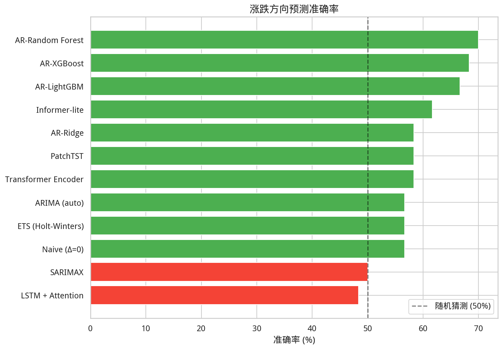
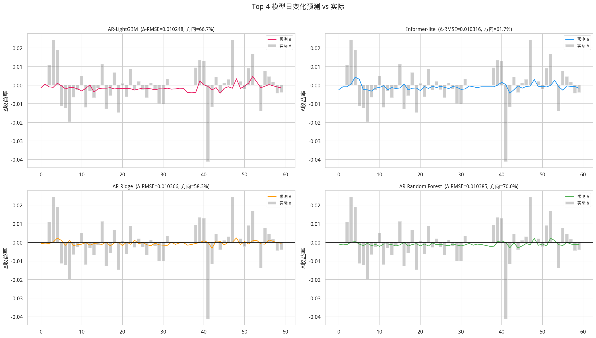

# 中国10年期国债收益率预测 — 多模型自回归比较报告

> 生成时间: 2026-03-27 03:18:36

> **预测目标: 每日变化 Δy(t) = yield(t) - yield(t-1)**
---

## 1. 研究概述

**目标**: 预测中国10年期国债收益率的**每日变化量**，消除前一日水平值的主导效应，
真正检验模型是否能捕捉到预测性信号。

**关键设计**:
- 预测 Δy(t) = yield(t) - yield(t-1)，而非 yield(t) 本身
- 还原收益率水平: ŷ(t) = y(t-1) + Δŷ(t)
- 新增**方向准确率**指标: 模型预测涨跌方向的正确比例
- Naive 基线变为 Δ=0（即预测"不变"），这是金融序列中最难超越的基线

**数据**: 2015-01-06 ~ 2026-03-25, 2927 个交易日
- Δyield 均值=-0.000620, std=0.022457
- 训练集: 2867, 测试集: 60 个交易日

## 2. 模型说明

### 统计模型
| 模型 | 方法 |
|---|---|
| ARIMA (auto) | 对 Δy 序列自动选择 (p,d,q)，AIC 优化 |
| SARIMAX | 对 Δy 序列做季节性 ARIMA |
| ETS (Holt-Winters) | 对 Δy 序列做指数平滑 |

### ML 模型 (滞后特征 → 回归)
| 模型 | 方法 |
|---|---|
| AR-XGBoost / AR-LightGBM | Δy 的滞后特征 + 梯度提升回归 |
| AR-Random Forest | Δy 的滞后特征 + 随机森林 |
| AR-Ridge | Δy 的滞后特征 + 岭回归 |

### Transformer 深度学习模型
| 模型 | 方法 |
|---|---|
| Transformer Encoder | 多头自注意力 + 位置编码，端到端预测 Δy |
| PatchTST | 序列分 patch → Transformer 编码 (2023 SOTA) |
| LSTM + Attention | LSTM + 注意力池化 |
| Informer-lite | ProbSparse 注意力（降低复杂度） |

### 基线
| 模型 | 方法 |
|---|---|
| Naive (Δ=0) | 预测"不变"（Δ=0），等价于 ŷ(t)=y(t-1) |

## 3. 模型排行榜

|   排名 | model               |   Δ-RMSE |    Δ-MAE |   Level-RMSE |   Level-MAE |   Level-MAPE(%) |   Level-R² |   方向准确率(%) |   time_s | params                                            |
|-----:|:--------------------|---------:|---------:|-------------:|------------:|----------------:|-----------:|-----------:|---------:|:--------------------------------------------------|
|    1 | AR-LightGBM         | 0.010248 | 0.007278 |     0.010248 |    0.007278 |          0.3984 |     0.8654 |      66.67 |      4.2 | {'max_depth': 5, 'lr': 0.01, 'num_leaves': 31}    |
|    2 | Informer-lite       | 0.010316 | 0.007323 |     0.010316 |    0.007323 |          0.4009 |     0.8636 |      61.67 |     75.5 | d=32,h=4,L=3,lr=0.0005                            |
|    3 | AR-Ridge            | 0.010366 | 0.007294 |     0.010366 |    0.007294 |          0.3992 |     0.8623 |      58.33 |      0   | alpha=100.0                                       |
|    4 | AR-Random Forest    | 0.010385 | 0.007335 |     0.010385 |    0.007335 |          0.4015 |     0.8618 |      70    |     13.3 | {'n_estimators': 200, 'max_depth': 10}            |
|    5 | AR-XGBoost          | 0.010387 | 0.007423 |     0.010387 |    0.007423 |          0.4063 |     0.8617 |      68.33 |      3.4 | {'max_depth': 3, 'lr': 0.01, 'n_estimators': 500} |
|    6 | LSTM + Attention    | 0.010476 | 0.007361 |     0.010476 |    0.007361 |          0.4027 |     0.8593 |      48.33 |     37.8 | h=32,L=2,lr=0.001                                 |
|    7 | ETS (Holt-Winters)  | 0.010491 | 0.007349 |     0.010491 |    0.007349 |          0.4021 |     0.8589 |      56.67 |      0.2 | trend=None, damped=False                          |
|    8 | Naive (Δ=0)         | 0.010496 | 0.007267 |     0.010496 |    0.007267 |          0.3975 |     0.8588 |      56.67 |      0   | Δ(t)=0                                            |
|    9 | SARIMAX             | 0.010497 | 0.007287 |     0.010497 |    0.007287 |          0.3986 |     0.8588 |      50    |      7.9 | order=(1, 0, 2), seasonal=(1, 0, 0, 5)            |
|   10 | ARIMA (auto)        | 0.010497 | 0.007286 |     0.010497 |    0.007286 |          0.3986 |     0.8588 |      56.67 |      1   | order=(0, 0, 1)                                   |
|   11 | Transformer Encoder | 0.010633 | 0.007824 |     0.010633 |    0.007824 |          0.4282 |     0.8551 |      58.33 |    109.1 | d=16,h=4,L=2,ff=32,lr=0.001                       |
|   12 | PatchTST            | 0.013611 | 0.010797 |     0.013611 |    0.010797 |          0.5916 |     0.7625 |      58.33 |     25.1 | patch=12,d=32,L=2,lr=0.0005                       |

## 4. 涨跌方向预测准确率

方向准确率是金融预测中最重要的实用指标之一，>50% 意味着模型优于随机猜测。

## 5. 预测可视化

### 5.1 日变化 Δy 预测 (Top-4)

### 5.2 还原收益率 (Top-4)

### 5.3 所有模型对比

## 6. 残差与误差分析

## 7. 特征重要性 (ML 模型)

## 8. 最优超参数

- **AR-LightGBM**: {'max_depth': 5, 'lr': 0.01, 'num_leaves': 31}
- **Informer-lite**: d=32,h=4,L=3,lr=0.0005
- **AR-Ridge**: alpha=100.0
- **AR-Random Forest**: {'n_estimators': 200, 'max_depth': 10}
- **AR-XGBoost**: {'max_depth': 3, 'lr': 0.01, 'n_estimators': 500}
- **LSTM + Attention**: h=32,L=2,lr=0.001

## 9. 结论

### 主要发现

1. **预测每日变化 vs 预测水平值**: 当预测目标改为 Δy(t) 后，消除了 lag-1 的主导效应，
   模型之间的差异更能反映其真实预测能力。Naive (Δ=0) 基线变得非常强劲。

2. **🏆 最优模型: AR-LightGBM** — Δ-RMSE=0.010248, 方向准确率=66.67%

3. **各类模型最优**:
   - 统计模型: ETS (Holt-Winters) (Δ-RMSE=0.010491, 方向=56.67%)
   - ML 模型: AR-LightGBM (Δ-RMSE=0.010248, 方向=66.67%)
   - Transformer: Informer-lite (Δ-RMSE=0.010316, 方向=61.67%)

4. **方向预测**: 方向准确率是交易策略的核心，>50% 表明模型具有实际价值。

5. **过拟合风险**: 在预测 Δy 时，过于复杂的模型（如深层 Transformer）容易过拟合训练集的
   噪声模式，反而不如简单模型（Ridge、浅层网络）。

### 建议

- 以**方向准确率**为主要选模标准，Δ-RMSE 为辅
- Transformer 模型需要更多数据或预训练才能充分发挥优势
- 可尝试将 Δy 预测与宏观因子（利差、CPI、M2）结合构建多因子模型
- 模型集成（ML + Transformer 加权）可能进一步提升方向准确率
