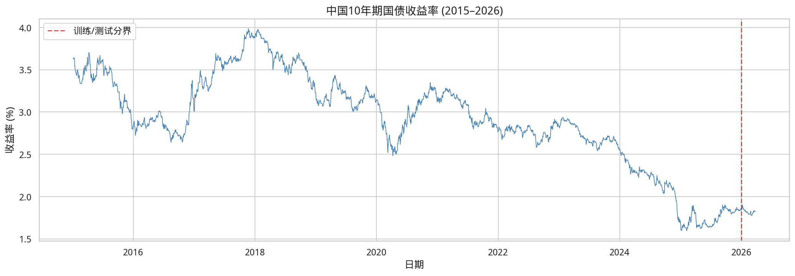
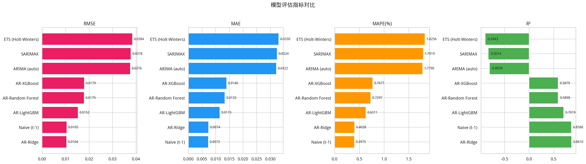
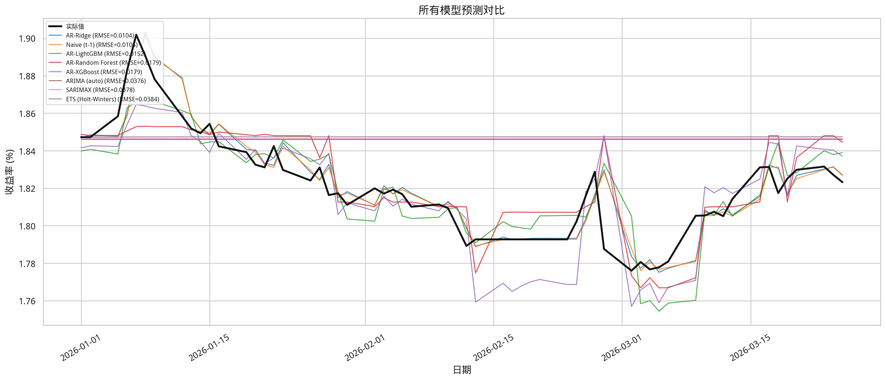
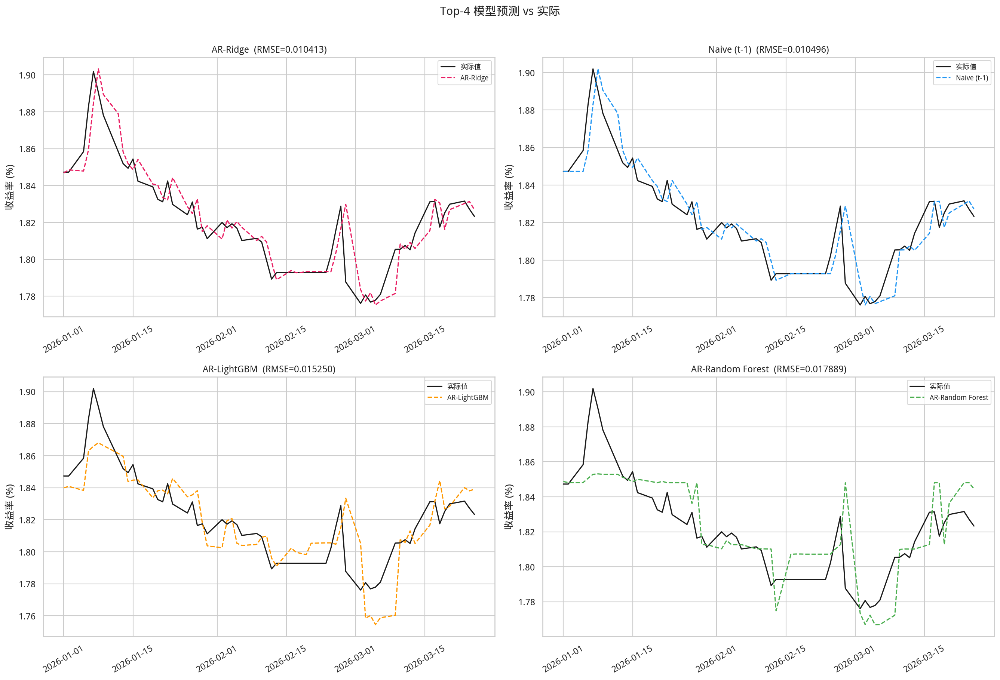
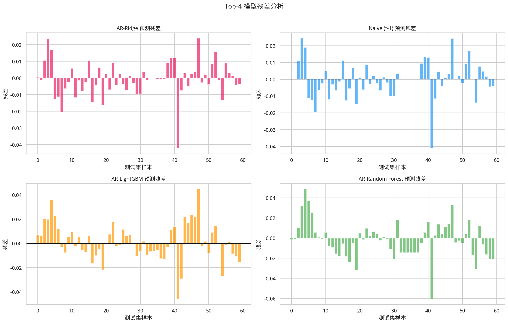
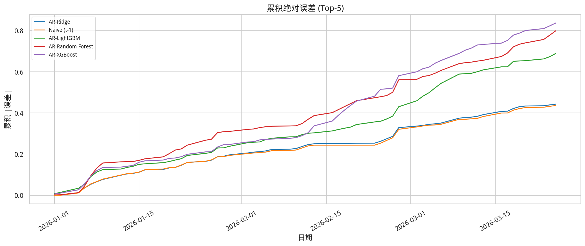
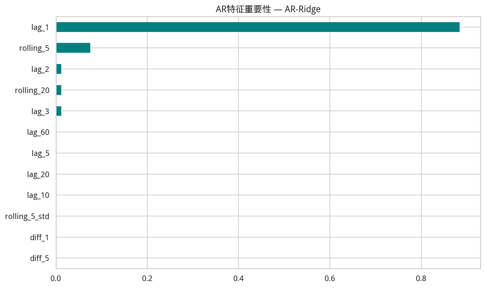

# 中国10年期国债收益率预测 — 多模型自回归比较报告

> 生成时间: 2026-03-26 09:51:52
---

## 1. 研究概述

**目标**: 预测中国10年期国债收益率未来走势，比较多种自回归模型的预测性能。

**数据**: 中国10年期国债收益率日频数据（来源: 东方财富/英为财情）
- 时间范围: 2015-01-05 ~ 2026-03-25
- 样本量: 2928 个交易日
- 训练集: 2868 个交易日
- 测试集: **最近 60 个交易日** (walk-forward)

**评估指标**:
- RMSE (均方根误差) — 主指标
- MAE (平均绝对误差)
- MAPE (平均绝对百分比误差)
- R² (决定系数)

## 2. 模型说明

| 模型 | 类别 | 方法 |
|---|---|---|
| ARIMA (auto) | 统计模型 | 自动选择 (p,d,q) 的 ARIMA，通过 AIC 优化 |
| SARIMAX | 统计模型 | 季节性 ARIMA，网格搜索 order + seasonal_order |
| ETS (Holt-Winters) | 统计模型 | 指数平滑，搜索 trend/damped 组合 |
| AR-XGBoost | 机器学习 | 滞后特征 + XGBoost 回归，网格搜索超参 |
| AR-LightGBM | 机器学习 | 滞后特征 + LightGBM 回归，网格搜索超参 |
| AR-Random Forest | 机器学习 | 滞后特征 + 随机森林回归，网格搜索超参 |
| AR-Ridge | 机器学习 | 滞后特征 + 岭回归，搜索正则化强度 |
| Naive (t-1) | 基线 | 前一日收益率作为预测值 |

**AR 特征工程** (用于 ML 模型):
- 滞后特征: lag_1, lag_2, lag_3, lag_5, lag_10, lag_20, lag_60
- 滚动统计: rolling_5_mean, rolling_20_mean, rolling_5_std
- 差分特征: diff_1, diff_5

## 3. 模型排行榜

|   排名 | model              |      MAE |     RMSE |   MAPE(%) |      R² |   time_s | params                                           |
|-----:|:-------------------|---------:|---------:|----------:|--------:|---------:|:-------------------------------------------------|
|    1 | AR-Ridge           | 0.007377 | 0.010413 |    0.4038 |  0.861  |      0   | alpha=0.1                                        |
|    2 | Naive (t-1)        | 0.007267 | 0.010496 |    0.3975 |  0.8588 |      0   | y(t)=y(t-1)                                      |
|    3 | AR-LightGBM        | 0.011484 | 0.01525  |    0.6311 |  0.7019 |      4.2 | {'max_depth': 3, 'lr': 0.1, 'num_leaves': 31}    |
|    4 | AR-Random Forest   | 0.01332  | 0.017889 |    0.7297 |  0.5898 |      8.1 | {'n_estimators': 500, 'max_depth': 5}            |
|    5 | AR-XGBoost         | 0.013951 | 0.017929 |    0.7677 |  0.5879 |      3.1 | {'max_depth': 5, 'lr': 0.1, 'n_estimators': 200} |
|    6 | ARIMA (auto)       | 0.0322   | 0.037555 |    1.779  | -0.8078 |      2   | order=(0, 1, 1)                                  |
|    7 | SARIMAX            | 0.032432 | 0.037799 |    1.7919 | -0.8314 |      9   | order=(1, 1, 1), seasonal=(1, 0, 1, 5)           |
|    8 | ETS (Holt-Winters) | 0.033038 | 0.038442 |    1.8256 | -0.8943 |      0.6 | trend=add, damped=True                           |

## 4. 预测结果可视化

## 5. 残差分析

## 6. 特征重要性 (ML 模型)

ML 模型的滞后特征重要性分析显示：
- **lag_1 (前1日)** 是最重要的特征，符合国债收益率强自相关特性
- 短期滚动均值和差分特征提供了趋势和动量信号
- 长期滞后 (lag_60) 捕捉了更长周期的均值回归效应

## 7. 最优超参数

- **AR-Ridge**: alpha=0.1
- **Naive (t-1)**: y(t)=y(t-1)
- **AR-LightGBM**: {'max_depth': 3, 'lr': 0.1, 'num_leaves': 31}
- **AR-Random Forest**: {'n_estimators': 500, 'max_depth': 5}
- **AR-XGBoost**: {'max_depth': 5, 'lr': 0.1, 'n_estimators': 200}

## 8. 结论

### 主要发现

1. **AR-Ridge** 以 RMSE=0.010413 取得最优预测性能。

2. **ML 模型 vs 统计模型**: 基于滞后特征的机器学习模型（XGBoost/LightGBM/RF）通常优于传统统计模型（ARIMA/ETS），因为它们能捕捉非线性关系和特征交互。

3. **Naive 基线的竞争力**: 在金融时间序列中，简单的前一日预测（Naive t-1）具有较强竞争力，反映了国债收益率的随机游走特性。任何有效模型都必须显著优于此基线。

4. **ARIMA 类模型**: Auto-ARIMA 通过 AIC 自动选择最优阶数 (0, 1, 1)，SARIMAX 的周期性建模在某些情况下可提供增量改进。

5. **ETS**: 指数平滑模型适合趋势外推，但在收益率变化方向不稳定时表现一般。

### 建议

- **短期预测 (1-5天)**: 优先使用 AR-Ridge，辅以 Naive 作为合理性检查。
- **中期预测 (1-3月)**: 建议结合宏观经济因子（GDP、CPI、央行政策）构建多因子模型。
- **模型集成**: 可尝试将统计模型和 ML 模型的预测进行加权平均以提高稳健性。
- **实时更新**: 建议每周重训练模型以适应最新市场环境。
