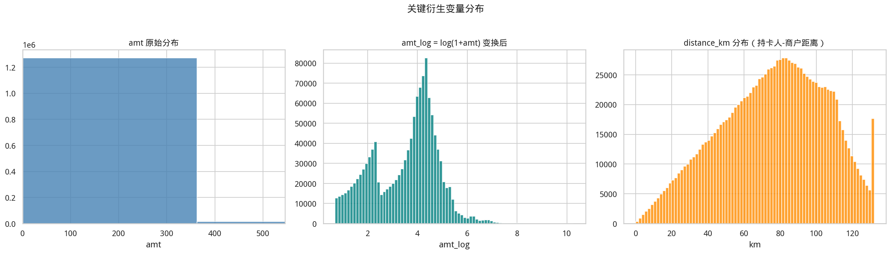
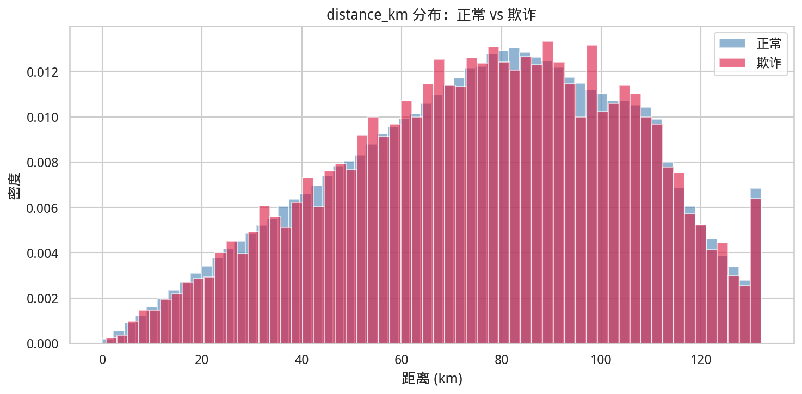
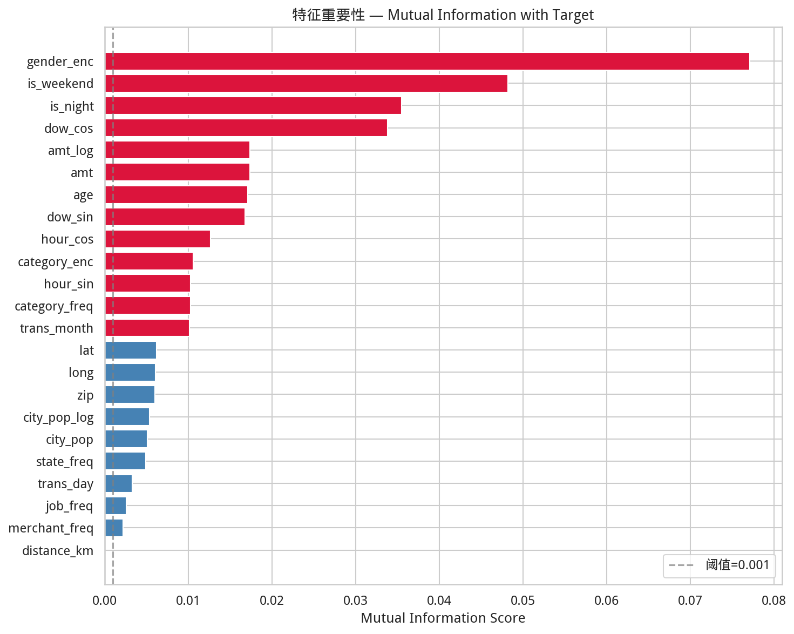
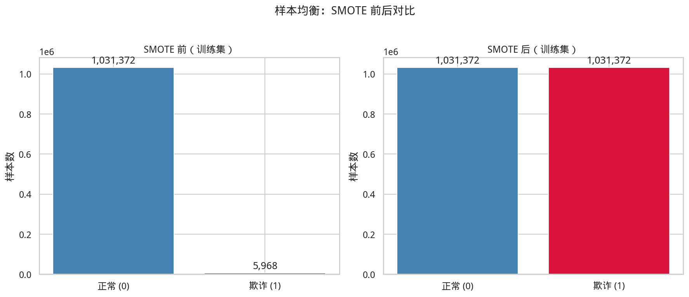
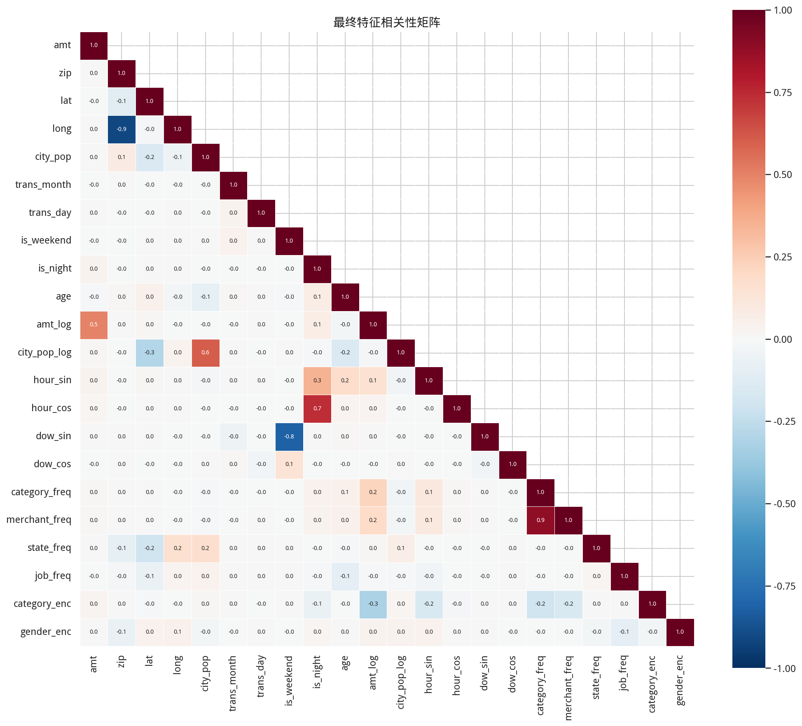

# 数据准备与特征工程报告

> 生成时间: 2026-03-13 01:39:53

---

## 1. 概述

本报告描述了 `fraudTrain.csv` 从原始数据到建模可用数据集的完整处理流程，包括：
- 衍生变量构造
- 变量筛选与剔除
- 数值变换与缩放
- 特征重要性评估
- 训练集/测试集划分
- SMOTE 样本均衡

## 2. 衍生变量

共构造 **20** 个衍生特征：

| 特征 | 类别 | 说明 |
|---|---|---|
| `trans_hour` | 时间特征 | 交易发生的小时 (0-23) |
| `trans_dayofweek` | 时间特征 | 交易发生的星期几 (0=Mon, 6=Sun) |
| `trans_month` | 时间特征 | 交易发生的月份 (1-12) |
| `trans_day` | 时间特征 | 交易发生的日期 (1-31) |
| `is_weekend` | 时间特征 | 是否周末 (0/1) |
| `is_night` | 时间特征 | 是否夜间 22:00-05:00 (0/1) |
| `hour_sin` | 时间特征（周期编码） | 小时正弦编码 |
| `hour_cos` | 时间特征（周期编码） | 小时余弦编码 |
| `dow_sin` | 时间特征（周期编码） | 星期正弦编码 |
| `dow_cos` | 时间特征（周期编码） | 星期余弦编码 |
| `age` | 人口统计 | 持卡人年龄（由 dob 计算） |
| `distance_km` | 地理特征 | 持卡人与商户之间的 Haversine 距离 (km) |
| `amt_log` | 金额变换 | log(1 + amt)，缓解右偏 |
| `city_pop_log` | 人口变换 | log(1 + city_pop)，缓解右偏 |
| `category_freq` | 频率编码 | 消费类别出现频率 |
| `merchant_freq` | 频率编码 | 商户出现频率 |
| `state_freq` | 频率编码 | 州出现频率 |
| `job_freq` | 频率编码 | 职业出现频率 |
| `category_enc` | 标签编码 | 消费类别的 Label Encoding |
| `gender_enc` | 二值编码 | 性别 (M=1, F=0) |





## 3. 剔除变量

共剔除 **19** 个原始列：

| 剔除列 | 原因 |
|---|---|
| `row_index` | ID 列，无预测价值 |
| `trans_num` | ID 列，无预测价值 |
| `cc_num` | ID 列，无预测价值 |
| `unix_time` | ID 列，时间信息已由派生特征覆盖 |
| `trans_date_trans_time` | 时间戳已拆解为多个时间特征 |
| `dob` | 已转化为 age 特征 |
| `first` | 个人信息文本，高基数无预测价值 |
| `last` | 个人信息文本，高基数无预测价值 |
| `street` | 地址文本，高基数低信息量 |
| `merchant` | 已通过 merchant_freq 频率编码 |
| `category` | 已通过 category_enc + category_freq 编码 |
| `gender` | 已通过 gender_enc 二值编码 |
| `city` | 高基数 (894 值)，信息量低 |
| `state` | 已通过 state_freq 频率编码 |
| `job` | 已通过 job_freq 频率编码 |
| `merch_lat` | 与 lat 高度相关 (r=0.99)，用 distance_km 替代 |
| `merch_long` | 与 long 高度相关 (r=0.99)，用 distance_km 替代 |
| `trans_hour` | 已通过 hour_sin/cos 周期编码替代 |
| `trans_dayofweek` | 已通过 dow_sin/cos 周期编码替代 |

## 4. 数值变换

| 变换 | 目标列 | 方法 | 说明 |
|---|---|---|---|
| 对数变换 | `amt` → `amt_log` | `log(1+x)` | 缓解交易金额严重右偏 (skew=42.3) |
| 对数变换 | `city_pop` → `city_pop_log` | `log(1+x)` | 缓解城市人口严重右偏 (skew=5.6) |
| 周期编码 | `trans_hour` → `hour_sin/cos` | 正弦/余弦 | 保留小时的周期性（23→0 连续） |
| 周期编码 | `trans_dayofweek` → `dow_sin/cos` | 正弦/余弦 | 保留星期的周期性 |
| 频率编码 | `category/merchant/state/job` | 频率占比 | 高基数分类变量 → 连续值 |
| 全局缩放 | 所有数值特征 | RobustScaler | 基于中位数和 IQR，对异常值鲁棒 |

## 5. 特征重要性（Mutual Information）



| 排名 | 特征 | MI Score |
|---|---|---|
| 1 | `gender_enc` | 0.0771 |
| 2 | `is_weekend` | 0.0482 |
| 3 | `is_night` | 0.0355 |
| 4 | `dow_cos` | 0.0338 |
| 5 | `amt_log` | 0.0174 |
| 6 | `amt` | 0.0174 |
| 7 | `age` | 0.0171 |
| 8 | `dow_sin` | 0.0168 |
| 9 | `hour_cos` | 0.0127 |
| 10 | `category_enc` | 0.0106 |
| 11 | `hour_sin` | 0.0103 |
| 12 | `category_freq` | 0.0103 |
| 13 | `trans_month` | 0.0102 |
| 14 | `lat` | 0.0062 |
| 15 | `long` | 0.0061 |
| 16 | `zip` | 0.0061 |
| 17 | `city_pop_log` | 0.0054 |
| 18 | `city_pop` | 0.0051 |
| 19 | `state_freq` | 0.0049 |
| 20 | `trans_day` | 0.0033 |
| 21 | `job_freq` | 0.0026 |
| 22 | `merchant_freq` | 0.0022 |
| 23 | `distance_km` | 0.0000 ⚠️ |

> ⚠️ 已剔除 MI < 0.001 的低信息特征: `distance_km`

## 6. 训练集 / 测试集划分

采用 **基于时间的划分** (time‑based split)，避免数据泄漏：
- **划分日期**: `2020-03-06 07:16:43`
- **划分比例**: 前 80% 为训练集，后 20% 为测试集

| 数据集 | 样本数 | 欺诈数 | 欺诈率 |
|---|---|---|---|
| 训练集 | 1,037,340 | 5,968 | 0.58% |
| 测试集 | 259,335 | 1,538 | 0.59% |

## 7. 样本均衡 — SMOTE

对训练集使用 **SMOTE (Synthetic Minority Over-sampling Technique)** 进行过采样：
- 算法: SMOTE (k_neighbors=5)
- 策略: sampling_strategy=1.0（使正负样本数量相等）

| 阶段 | 正常样本 | 欺诈样本 | 总计 | 欺诈比例 |
|---|---|---|---|---|
| SMOTE 前 | 1,031,372 | 5,968 | 1,037,340 | 0.58% |
| SMOTE 后 | 1,031,372 | 1,031,372 | 2,062,744 | 50.00% |

> **注意**: SMOTE 仅应用于训练集，测试集保持原始分布以反映真实场景。



## 8. 最终特征集

最终进入模型的特征共 **22** 个：



```
amt, zip, lat, long, city_pop, trans_month, trans_day, is_weekend, is_night, age, amt_log, city_pop_log, hour_sin, hour_cos, dow_sin, dow_cos, category_freq, merchant_freq, state_freq, job_freq, category_enc, gender_enc
```

## 9. 输出文件

| 文件 | 说明 |
|---|---|
| `data/processed/X_train.csv` | 训练集特征（缩放后，原始比例） |
| `data/processed/y_train.csv` | 训练集标签 |
| `data/processed/X_test.csv` | 测试集特征（缩放后） |
| `data/processed/y_test.csv` | 测试集标签 |
| `data/processed/X_train_smote.csv` | 训练集特征（SMOTE 均衡后） |
| `data/processed/y_train_smote.csv` | 训练集标签（SMOTE 均衡后） |
| `data/processed/feature_metadata.csv` | 特征 MI 重要性排名 |
| `data/processed/scaler.pkl` | RobustScaler 拟合参数 |
| `data/processed/le_category.pkl` | 类别 LabelEncoder |
