# fraudTrain.csv 探索性数据分析 (EDA) 报告

> 生成时间: 2026-03-13 01:36:49

---

## 1. 数据集概览

- **来源**: Kaggle `kartik2112/fraud-detection`
- **文件**: `data/fraudTrain.csv`
- **总行数**: 1,296,675
- **总列数**: 23
- **目标变量**: `is_fraud`（二分类：0=正常, 1=欺诈）

## 2. 各维度说明

| 列名                    | 数据类型           | 维度类别   | 说明                                  |
|:----------------------|:---------------|:-------|:------------------------------------|
| row_index             | int64          | ID     | 原始行索引                               |
| trans_date_trans_time | datetime64[us] | 时间     | 交易发生的日期和时间                          |
| cc_num                | int64          | ID     | 信用卡号（脱敏）                            |
| merchant              | str            | 分类     | 商户名称                                |
| category              | str            | 分类     | 消费类别（如 grocery_pos, shopping_net 等） |
| amt                   | float64        | 数值     | 交易金额（美元）                            |
| first                 | str            | 分类     | 持卡人名                                |
| last                  | str            | 分类     | 持卡人姓                                |
| gender                | str            | 分类     | 持卡人性别（M/F）                          |
| street                | str            | 分类     | 持卡人街道地址                             |
| city                  | str            | 分类     | 持卡人所在城市                             |
| state                 | str            | 分类     | 持卡人所在州                              |
| zip                   | int64          | 数值     | 持卡人邮编                               |
| lat                   | float64        | 数值     | 交易纬度                                |
| long                  | float64        | 数值     | 交易经度                                |
| city_pop              | int64          | 数值     | 城市人口                                |
| job                   | str            | 分类     | 持卡人职业                               |
| dob                   | datetime64[us] | 时间     | 持卡人出生日期                             |
| trans_num             | str            | ID     | 交易唯一编号                              |
| unix_time             | int64          | ID     | 交易的 Unix 时间戳                        |
| merch_lat             | float64        | 数值     | 商户纬度                                |
| merch_long            | float64        | 数值     | 商户经度                                |
| is_fraud              | int64          | 目标     | 是否欺诈（0=正常，1=欺诈）                     |
| age                   | float64        | 数值（派生） | 持卡人年龄（由 dob 计算）                     |

## 3. 缺失值分析

**所有列均无缺失值。** 数据完整性良好。

| 列名                    |   缺失数 |   缺失率(%) |
|:----------------------|------:|---------:|
| row_index             |     0 |        0 |
| trans_date_trans_time |     0 |        0 |
| cc_num                |     0 |        0 |
| merchant              |     0 |        0 |
| category              |     0 |        0 |
| amt                   |     0 |        0 |
| first                 |     0 |        0 |
| last                  |     0 |        0 |
| gender                |     0 |        0 |
| street                |     0 |        0 |

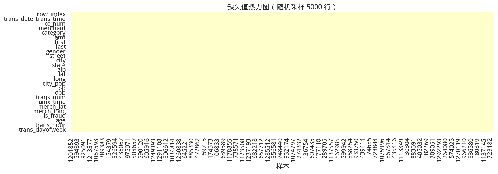

## 4. 异常值分析（IQR 方法）

使用 1.5×IQR 规则检测数值型特征的异常值：

| 特征         |       Q1 |       Q3 |      IQR |        下界 |        上界 |   异常值数 |   异常值占比(%) |
|:-----------|---------:|---------:|---------:|----------:|----------:|-------:|-----------:|
| city_pop   |   743    | 20328    | 19585    | -28634.5  |  49705.5  | 242674 |      18.72 |
| amt        |     9.65 |    83.14 |    73.49 |   -100.58 |    193.38 |  67290 |       5.19 |
| long       |   -96.8  |   -80.16 |    16.64 |   -121.76 |    -55.2  |  49922 |       3.85 |
| merch_long |   -96.9  |   -80.24 |    16.66 |   -121.89 |    -55.25 |  41994 |       3.24 |
| merch_lat  |    34.73 |    41.96 |     7.22 |     23.9  |     52.79 |   4967 |       0.38 |
| lat        |    34.62 |    41.94 |     7.32 |     23.64 |     52.92 |   4679 |       0.36 |
| age        |    32.6  |    57.07 |    24.47 |     -4.11 |     93.78 |   1082 |       0.08 |
| zip        | 26237    | 72042    | 45805    | -42470.5  | 140750    |      0 |       0    |

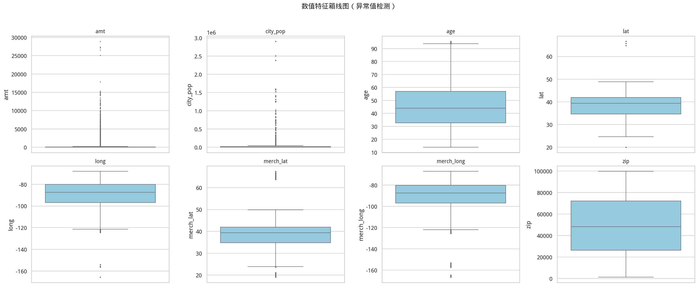

## 5. 数据分布分析

### 5.1 数值特征分布

| 特征         |       count |       mean |         std |       min |        25% |        50% |        75% |            max |    skew |   kurtosis |
|:-----------|------------:|-----------:|------------:|----------:|-----------:|-----------:|-----------:|---------------:|--------:|-----------:|
| amt        | 1.29668e+06 |    70.351  |    160.316  |    1      |     9.65   |    47.52   |    83.14   | 28948.9        | 42.2779 |  4545.65   |
| zip        | 1.29668e+06 | 48800.7    |  26893.2    | 1257      | 26237      | 48174      | 72042      | 99783          |  0.0797 |    -1.0964 |
| lat        | 1.29668e+06 |    38.5376 |      5.0758 |   20.0271 |    34.6205 |    39.3543 |    41.9404 |    66.6933     | -0.186  |     0.813  |
| long       | 1.29668e+06 |   -90.2263 |     13.7591 | -165.672  |   -96.798  |   -87.4769 |   -80.158  |   -67.9503     | -1.1501 |     1.8559 |
| city_pop   | 1.29668e+06 | 88824.4    | 301956      |   23      |   743      |  2456      | 20328      |     2.9067e+06 |  5.5939 |    37.6145 |
| merch_lat  | 1.29668e+06 |    38.5373 |      5.1098 |   19.0278 |    34.7336 |    39.3657 |    41.9572 |    67.5103     | -0.1819 |     0.796  |
| merch_long | 1.29668e+06 |   -90.2265 |     13.7711 | -166.671  |   -96.8973 |   -87.4384 |   -80.2368 |   -66.9509     | -1.147  |     1.8485 |
| age        | 1.29668e+06 |    45.9964 |     17.394  |   13.922  |    32.5996 |    43.9699 |    57.0705 |    95.6386     |  0.6116 |    -0.177  |

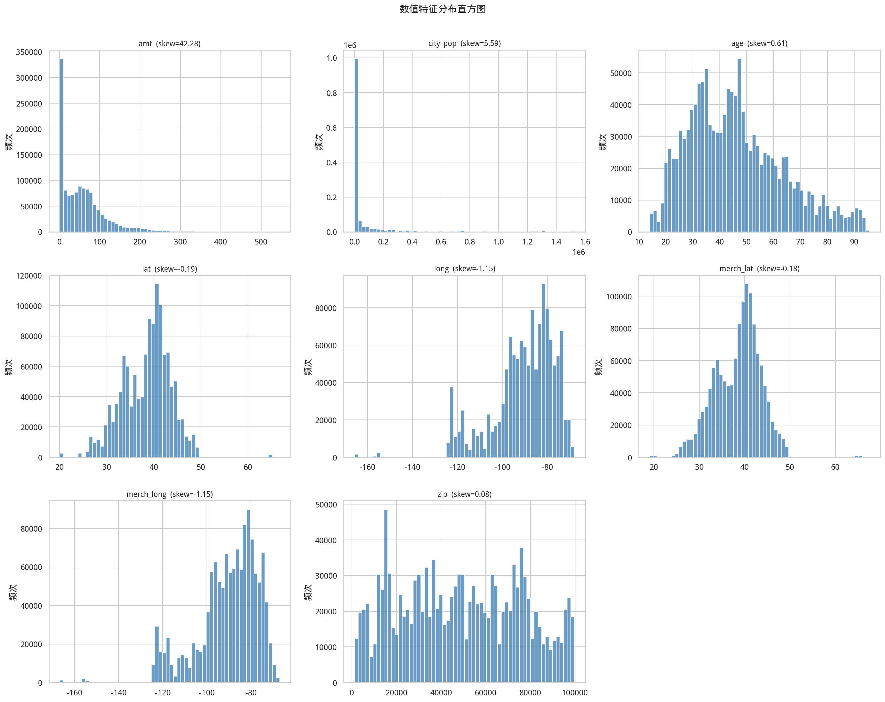

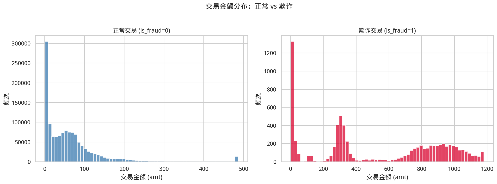

### 5.2 分类特征分布

| 特征       |   唯一值数 | 最高频值                |   最高频次 |   最高频占比(%) |
|:---------|-------:|:--------------------|-------:|-----------:|
| merchant |    693 | fraud_Kilback LLC   |   4403 |       0.34 |
| category |     14 | gas_transport       | 131659 |      10.15 |
| first    |    352 | Christopher         |  26669 |       2.06 |
| last     |    481 | Smith               |  28794 |       2.22 |
| gender   |      2 | F                   | 709863 |      54.74 |
| street   |    983 | 864 Reynolds Plains |   3123 |       0.24 |
| city     |    894 | Birmingham          |   5617 |       0.43 |
| state    |     51 | TX                  |  94876 |       7.32 |
| job      |    494 | Film/video editor   |   9779 |       0.75 |

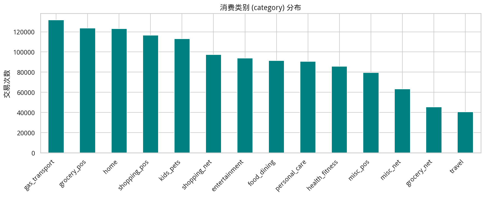

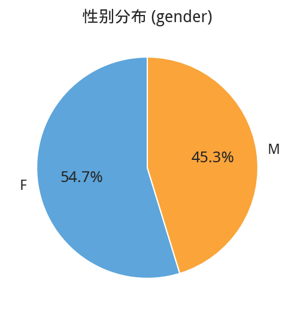

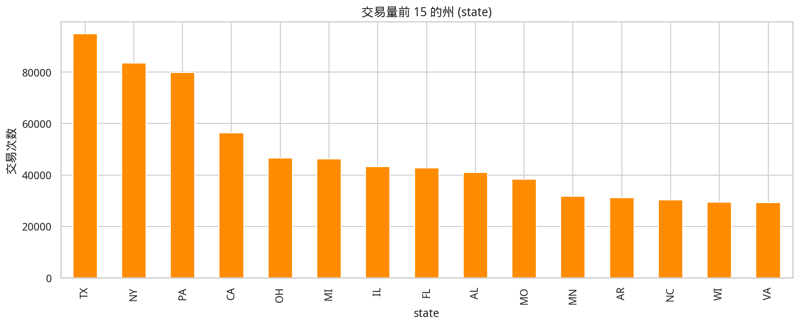

### 5.3 时间特征分布

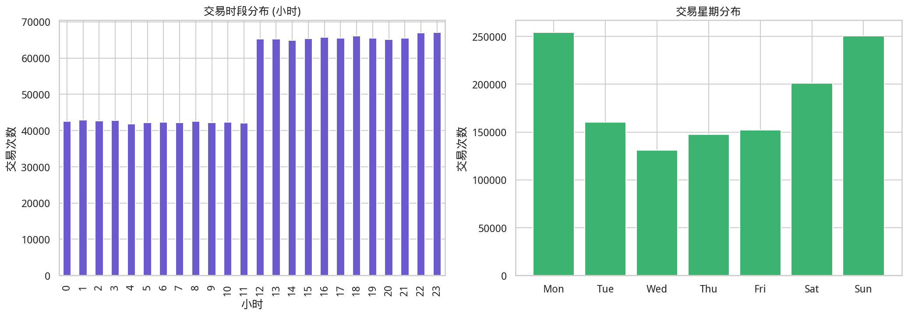

## 6. 相关性分析

### 6.1 数值特征相关性矩阵

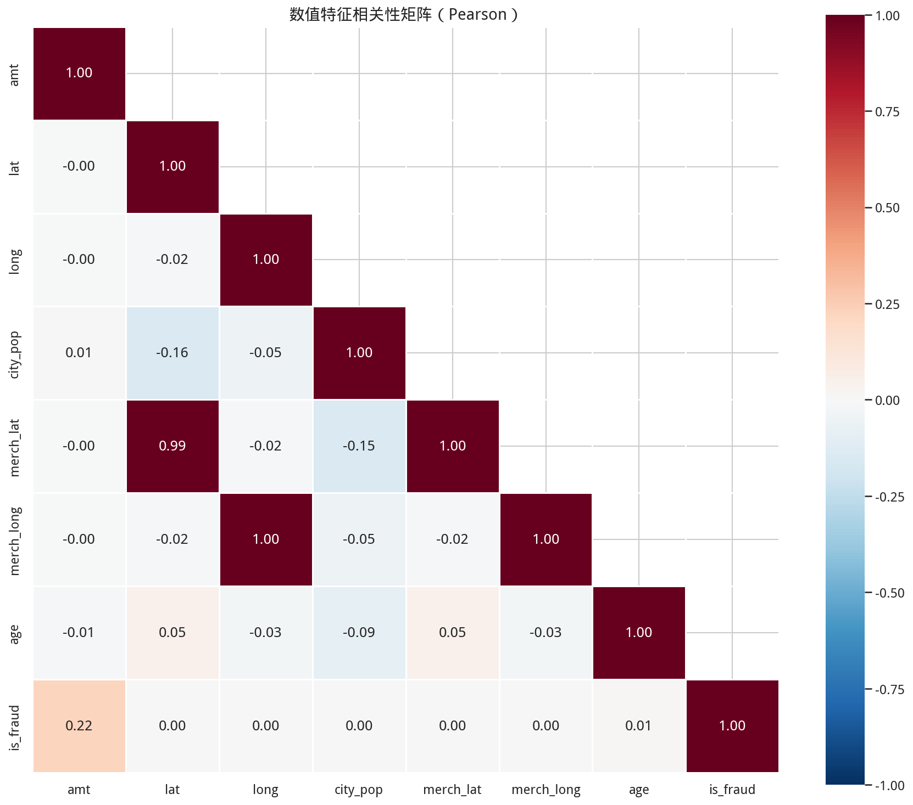

**高相关性特征对（|r| > 0.5）：**

| 特征A   | 特征B        |   相关系数 |
|:------|:-----------|-------:|
| lat   | merch_lat  | 0.9936 |
| long  | merch_long | 0.9991 |

### 6.2 相关性层次聚类

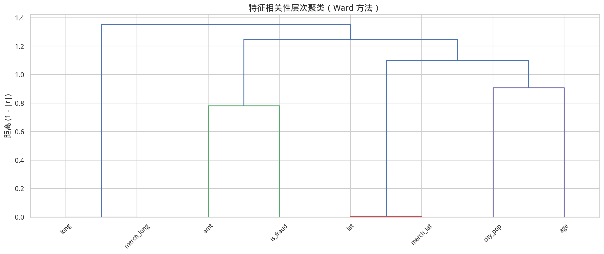

### 6.3 各特征与目标变量 (is_fraud) 的相关性

| 特征         | 类型   |   相关系数(point-biserial r) |   p-value |
|:-----------|:-----|-------------------------:|----------:|
| amt        | 数值   |                   0.2194 |  0        |
| age        | 数值   |                   0.0123 |  2.28e-44 |
| zip        | 数值   |                  -0.0022 |  0.0138   |
| city_pop   | 数值   |                   0.0021 |  0.015    |
| lat        | 数值   |                   0.0019 |  0.031    |
| long       | 数值   |                   0.0017 |  0.0501   |
| merch_lat  | 数值   |                   0.0017 |  0.0475   |
| merch_long | 数值   |                   0.0017 |  0.05     |

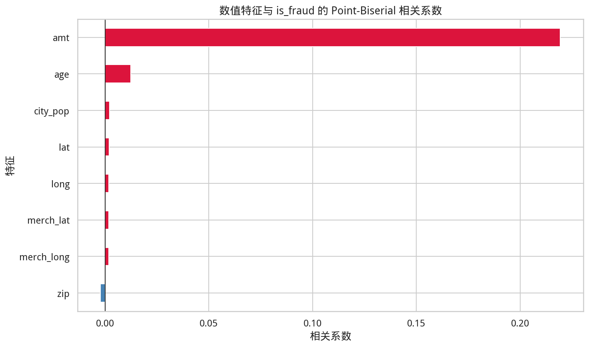

**分类特征与目标的关系（各类别欺诈率）：**

**category 维度欺诈率：**

| category       | 欺诈率            |
|:---------------|:---------------|
| shopping_net   | 0.0176 (1.76%) |
| misc_net       | 0.0145 (1.45%) |
| grocery_pos    | 0.0141 (1.41%) |
| shopping_pos   | 0.0072 (0.72%) |
| gas_transport  | 0.0047 (0.47%) |
| misc_pos       | 0.0031 (0.31%) |
| grocery_net    | 0.0029 (0.29%) |
| travel         | 0.0029 (0.29%) |
| entertainment  | 0.0025 (0.25%) |
| personal_care  | 0.0024 (0.24%) |
| kids_pets      | 0.0021 (0.21%) |
| food_dining    | 0.0017 (0.17%) |
| home           | 0.0016 (0.16%) |
| health_fitness | 0.0015 (0.15%) |

**gender 维度欺诈率：**

| gender   | 欺诈率            |
|:---------|:---------------|
| M        | 0.0064 (0.64%) |
| F        | 0.0053 (0.53%) |

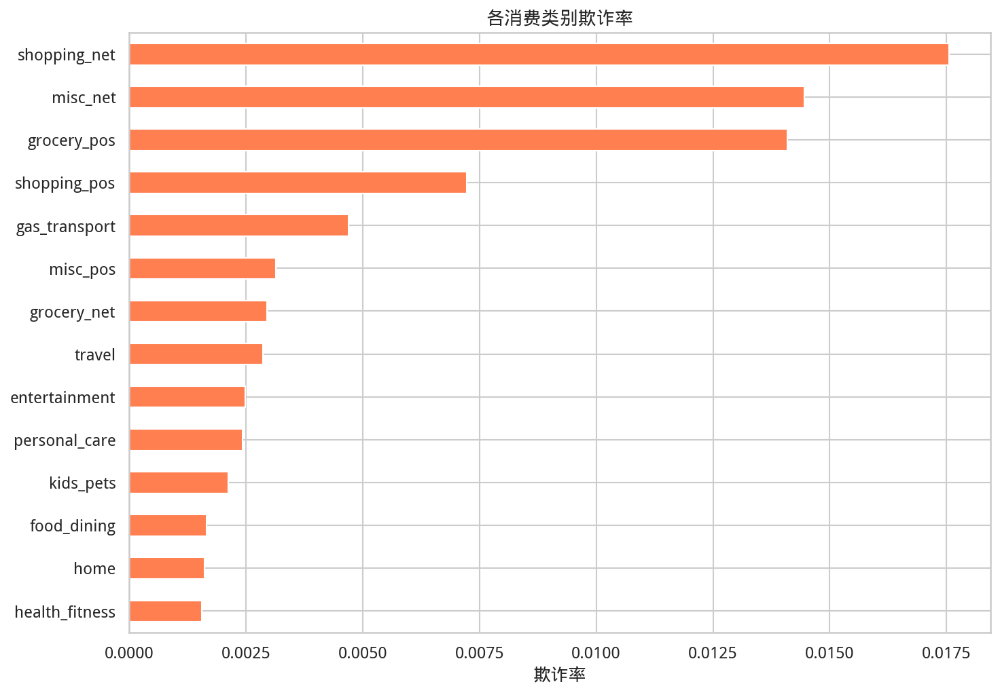

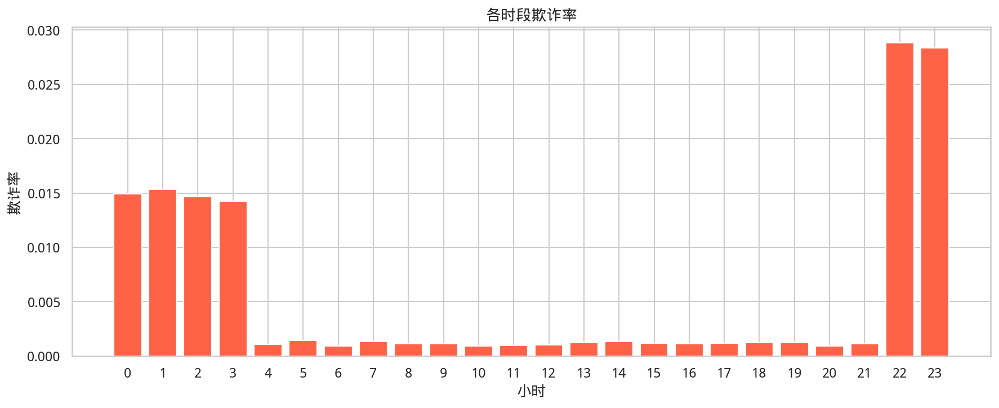

## 7. 目标变量与样本平衡分析

| 类别 | 样本数 | 占比 |
|---|---|---|
| 正常 (0) | 1,289,169 | 99.42% |
| 欺诈 (1) | 7,506 | 0.58% |
| **不平衡比** | **171.8 : 1** | |

- 正常样本数: **1,289,169**
- 欺诈样本数: **7,506**
- 不平衡比: **171.8 : 1**（严重不平衡）
- 目标变量缺失: **0**

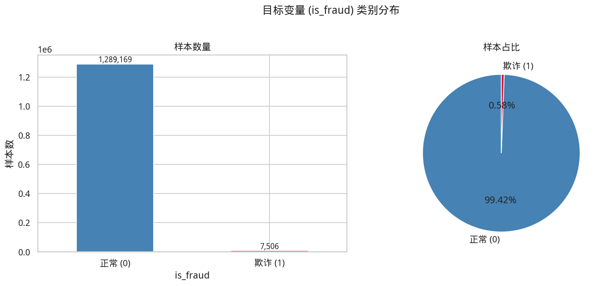

## 8. 正常 vs 欺诈样本的数值特征对比

| 特征_统计量            |      正常 (0) |      欺诈 (1) |
|:------------------|------------:|------------:|
| amt_mean          |     67.6671 |    531.32   |
| amt_median        |     47.28   |    396.505  |
| amt_std           |    154.008  |    390.56   |
| age_mean          |     45.9801 |     48.7935 |
| age_median        |     43.9562 |     47.8029 |
| age_std           |     17.3838 |     18.8686 |
| city_pop_mean     |  88775.2    |  97276.8    |
| city_pop_median   |   2456      |   2623      |
| city_pop_std      | 301807      | 326581      |
| lat_mean          |     38.5369 |     38.6636 |
| lat_median        |     39.3543 |     39.4336 |
| lat_std           |      5.0752 |      5.1723 |
| long_mean         |    -90.2281 |    -89.916  |
| long_median       |    -87.4769 |    -86.6919 |
| long_std          |     13.756  |     14.2782 |
| merch_lat_mean    |     38.5367 |     38.6539 |
| merch_lat_median  |     39.3653 |     39.427  |
| merch_lat_std     |      5.1091 |      5.2184 |
| merch_long_mean   |    -90.2283 |    -89.9158 |
| merch_long_median |    -87.4409 |    -86.813  |
| merch_long_std    |     13.7679 |     14.2987 |

## 9. 建模前建议

### 9.1 数据质量
- 数据集无缺失值，数据完整性良好。
- `amt`（交易金额）和 `city_pop`（城市人口）存在较多异常值（右偏分布），建模时可考虑对数变换或 RobustScaler。

### 9.2 类别不平衡处理
- 欺诈样本仅占约 0.58%，属于严重不平衡。
- 建议策略：SMOTE 过采样、欠采样、调整 `class_weight`、或使用 Focal Loss。
- 评估指标应以 **Precision、Recall、F1-Score、AUC-ROC、AUC-PR** 为主，不应使用 Accuracy。

### 9.3 特征工程建议
- **时间特征**: 交易小时、星期几（已提取），可进一步提取月份、是否节假日等。
- **地理特征**: 计算持卡人位置与商户位置的距离（`lat/long` vs `merch_lat/merch_long`）。
- **金额特征**: 对 `amt` 取对数变换；计算用户历史平均交易额的偏差。
- **类别编码**: `category` 可用 Target Encoding 或 Label Encoding；`merchant`、`job` 等高基数特征可考虑 Frequency Encoding。
- **ID 类字段**: `row_index`、`trans_num`、`cc_num`、`unix_time` 不建议直接作为特征。
- **个人信息**: `first`、`last`、`street` 等对欺诈检测意义不大，建议剔除。

### 9.4 推荐模型
- **基线模型**: Logistic Regression
- **树模型**: LightGBM / XGBoost / Random Forest（通常在此类任务中表现最优）
- **深度学习**: 可尝试但表格数据上通常不优于树模型
- **集成方法**: Stacking / Blending 多个模型
