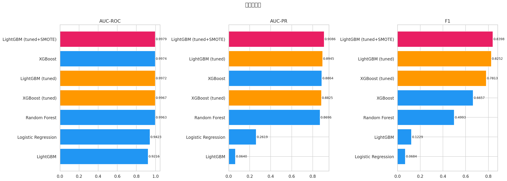
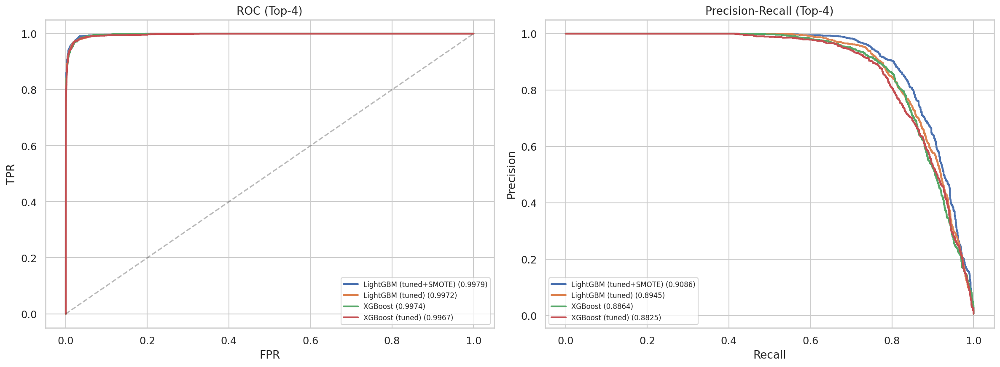
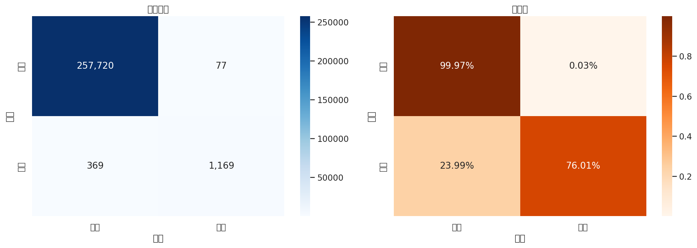
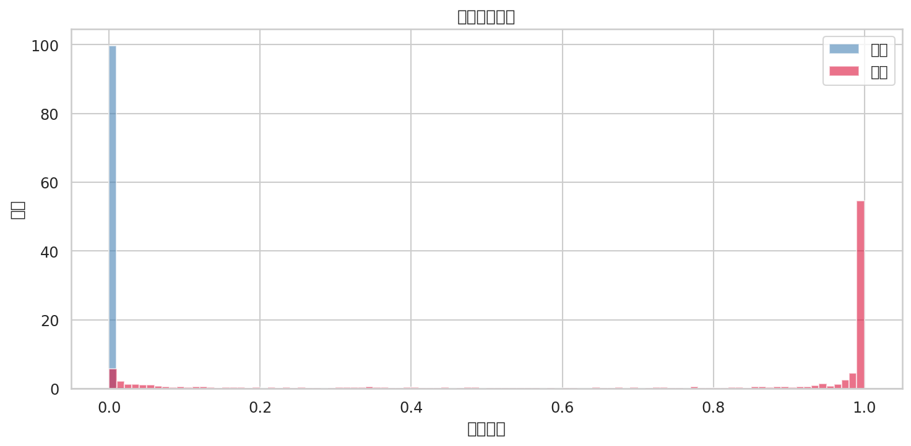
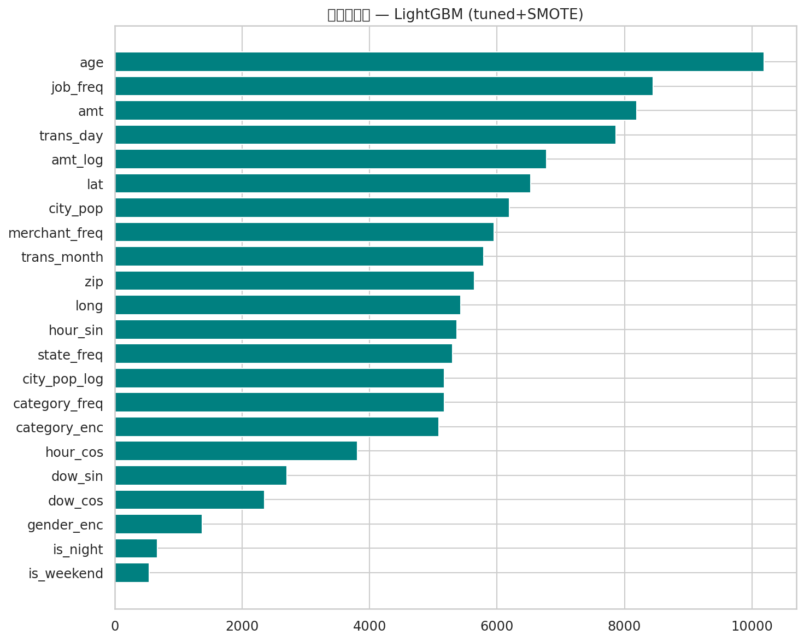
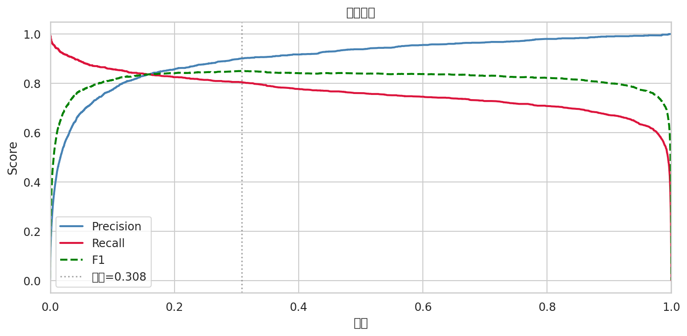

# 建模报告 — 信用卡欺诈检测

> 生成时间: 2026-03-11 07:25:34
---

## 1. 建模策略

| 阶段 | 方法 |
|---|---|
| Phase 1 | 4 种算法基线 (LR/RF/XGBoost/LightGBM)，class_weight 处理不平衡 |
| Phase 2 | XGBoost + LightGBM 网格搜索 (8 configs × early stopping) |
| Phase 3 | 最优参数在 SMOTE 均衡数据上重训练 |

**评估主指标**: AUC‑PR (Average Precision) — 最适合严重不平衡场景

## 2. 排行榜



|   AUC-ROC |   AUC-PR |     F1 |   Precision |   Recall |   Accuracy | model                  |   time_s |   val_auc_pr |   best_iters |
|----------:|---------:|-------:|------------:|---------:|-----------:|:-----------------------|---------:|-------------:|-------------:|
|    0.9979 |   0.9086 | 0.8398 |      0.9382 |   0.7601 |     0.9983 | LightGBM (tuned+SMOTE) |     46.4 |     nan      |         1000 |
|    0.9972 |   0.8945 | 0.8252 |      0.8669 |   0.7874 |     0.998  | LightGBM (tuned)       |     31.7 |       0.9827 |         1000 |
|    0.9974 |   0.8864 | 0.6657 |      0.5285 |   0.8992 |     0.9946 | XGBoost                |      5   |     nan      |          nan |
|    0.9967 |   0.8825 | 0.7813 |      0.7404 |   0.827  |     0.9973 | XGBoost (tuned)        |     46.8 |       0.9848 |          999 |
|    0.9963 |   0.8696 | 0.4993 |      0.3386 |   0.9506 |     0.9887 | Random Forest          |     52.3 |     nan      |          nan |
|    0.9423 |   0.2619 | 0.0684 |      0.0356 |   0.8628 |     0.8607 | Logistic Regression    |      9.8 |     nan      |          nan |
|    0.9216 |   0.064  | 0.1229 |      0.0659 |   0.9103 |     0.923  | LightGBM               |      5.7 |     nan      |          nan |

## 3. 超参数调优

方法: 8 组参数 × early stopping on 10% subsample → 最优参数 retrain on full data

### XGBoost (tuned)

- Val AUC-PR: 0.9848
- Test: AUC-ROC=0.9967 | AUC-PR=0.8825 | F1=0.7813 | P=0.7404 | R=0.827
- Best iterations: 999
- 最优参数:
```json
{
  "max_depth": 6,
  "learning_rate": 0.05,
  "subsample": 0.8,
  "colsample_bytree": 0.8,
  "min_child_weight": 3,
  "reg_alpha": 0,
  "reg_lambda": 1
}
```

### LightGBM (tuned)

- Val AUC-PR: 0.9827
- Test: AUC-ROC=0.9972 | AUC-PR=0.8945 | F1=0.8252 | P=0.8669 | R=0.7874
- Best iterations: 1000
- 最优参数:
```json
{
  "max_depth": 8,
  "learning_rate": 0.05,
  "subsample": 0.9,
  "colsample_bytree": 0.7,
  "min_child_samples": 10,
  "reg_alpha": 0,
  "reg_lambda": 5,
  "num_leaves": 127
}
```

## 4. 最终模型

### 🏆 LightGBM (tuned+SMOTE)

| 指标 | 值 |
|---|---|
| AUC-ROC | **0.9979** |
| AUC-PR | **0.9086** |
| F1 | **0.8398** |
| Precision | **0.9382** |
| Recall | **0.7601** |
| Accuracy | **0.9983** |





### Classification Report
```
              precision    recall  f1-score   support

          正常       1.00      1.00      1.00    257797
          欺诈       0.94      0.76      0.84      1538

    accuracy                           1.00    259335
   macro avg       0.97      0.88      0.92    259335
weighted avg       1.00      1.00      1.00    259335

```

## 5. 特征重要性



| 排名 | 特征 | 重要性 |
|---|---|---|
| 1 | `age` | 10187.0000 |
| 2 | `job_freq` | 8448.0000 |
| 3 | `amt` | 8192.0000 |
| 4 | `trans_day` | 7865.0000 |
| 5 | `amt_log` | 6777.0000 |
| 6 | `lat` | 6528.0000 |
| 7 | `city_pop` | 6192.0000 |
| 8 | `merchant_freq` | 5953.0000 |
| 9 | `trans_month` | 5792.0000 |
| 10 | `zip` | 5647.0000 |
| 11 | `long` | 5429.0000 |
| 12 | `hour_sin` | 5370.0000 |
| 13 | `state_freq` | 5305.0000 |
| 14 | `city_pop_log` | 5174.0000 |
| 15 | `category_freq` | 5173.0000 |
| 16 | `category_enc` | 5088.0000 |
| 17 | `hour_cos` | 3808.0000 |
| 18 | `dow_sin` | 2703.0000 |
| 19 | `dow_cos` | 2349.0000 |
| 20 | `gender_enc` | 1379.0000 |
| 21 | `is_night` | 671.0000 |
| 22 | `is_weekend` | 539.0000 |

## 6. 阈值优化



| 阈值 | F1 | Precision | Recall |
|---|---|---|---|
| 0.5 (默认) | 0.8398 | 0.9382 | 0.7601 |
| **0.3081 (最优)** | **0.8503** | **0.9010** | **0.8049** |

## 7. 结论

1. **LightGBM (tuned+SMOTE)** AUC‑PR 最优。
2. 梯度提升树显著优于线性模型和随机森林。
3. 最优阈值 **0.3081** (F1=0.8503)。
4. 进一步: Optuna 调参、Stacking 集成、用户行为特征。

## 8. 输出文件
| 文件 | 说明 |
|---|---|
| `data/models/best_model.pkl` | 最优模型 |
| `data/models/best_model_meta.json` | 模型元信息 |